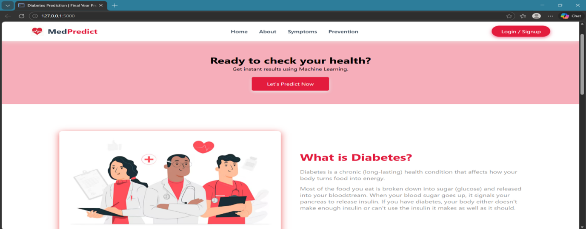
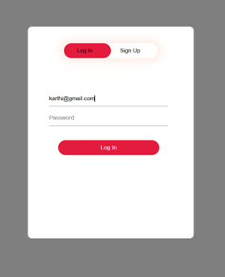
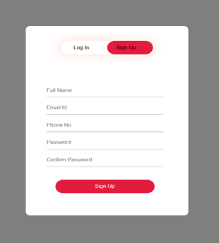
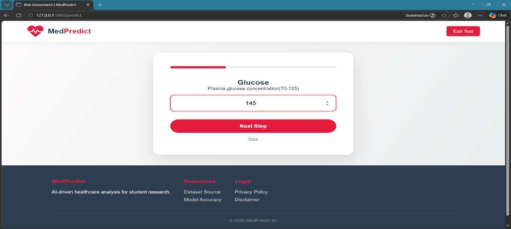
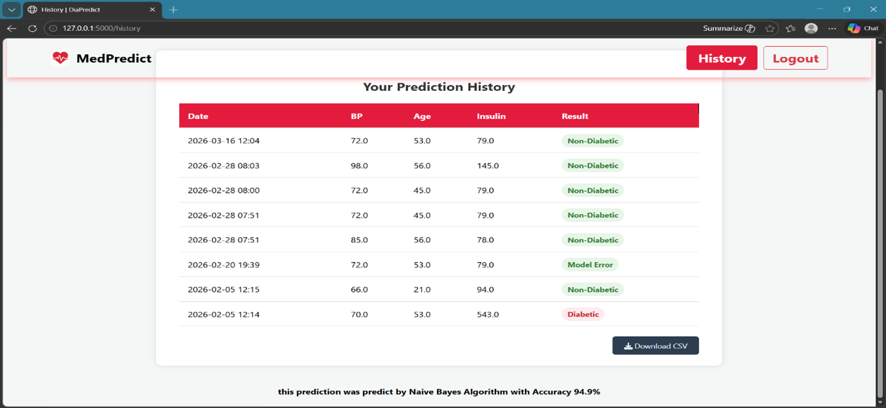
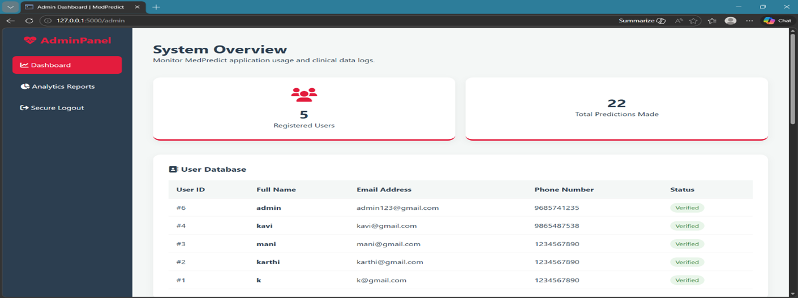
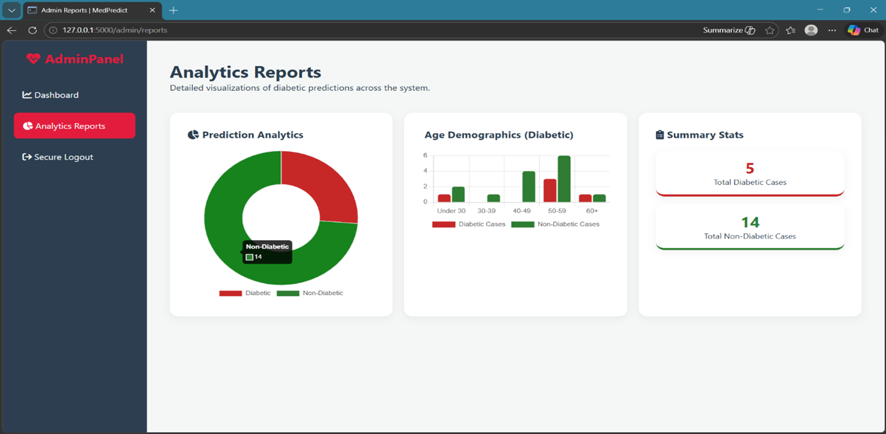

# 🩺 MedPredict — Early Diabetes Prediction Using Machine Learning


> A Flask-based Clinical Decision Support System (CDSS) for early Type 2 Diabetes prediction using a Stacking Ensemble of Naïve Bayes + CatBoost — achieving **94.95% test accuracy** and **98.65% ROC-AUC**.

---

## 📋 Table of Contents

- [Overview](#-overview)
- [Features](#-features)
- [Tech Stack](#-tech-stack)
- [Machine Learning Model](#-machine-learning-model)
- [Dataset](#-dataset)
- [Project Structure](#-project-structure)
- [Getting Started](#-getting-started)
- [Screenshots](#-screenshots)
- [Model Performance](#-model-performance)
- [Future Enhancements](#-future-enhancements)
- [Authors](#-authors)

---

## 🔍 Overview

**MedPredict** is a full-stack web application that deploys a highly optimized machine learning model to predict the risk of early-onset Type 2 Diabetes. Built as a BCA final-year project at **Sri Kaliswari College (Autonomous), Sivakasi**, it bridges the gap between academic data science and practical healthcare delivery.

The system evaluates 8 key clinical parameters — **Glucose, BMI, Age, Insulin, Blood Pressure, Skin Thickness, Pregnancies, and Diabetes Pedigree Function** — to provide instant, browser-accessible risk assessments for both patients and healthcare administrators.

---

## ✨ Features

- 🧪 **Interactive Risk Assessment Wizard** — Multi-step, keyboard-navigable form for patient input
- 🔐 **Secure Authentication** — User registration, login, and role-based access control
- 📊 **Real-Time Predictions** — Instant diabetes risk classification (Diabetic / Non-Diabetic)
- 🗂️ **Medical History Logging** — Persistent patient prediction logs stored in SQLite
- 📥 **CSV Export** — Download personal prediction history at any time
- 🛡️ **Admin Dashboard** — System-wide monitoring of users and prediction logs
- 📈 **Analytics Reports** — Visual charts (Chart.js) showing patient age distribution and outcome statistics

---

## 🛠 Tech Stack

| Layer        | Technology                          |
|--------------|-------------------------------------|
| **Frontend** | HTML5, CSS3, JavaScript, Chart.js   |
| **Backend**  | Python, Flask (MVC Architecture)    |
| **Database** | SQLite3                             |
| **ML Model** | Scikit-learn, CatBoost, Joblib      |
| **Data**     | Pandas, NumPy                       |

---

## 🤖 Machine Learning Model

The core predictive engine is a **custom Stacking Ensemble Classifier** built for maximum clinical accuracy:

```
Level 0 (Base Learners):
  ├── Pipeline 1: StandardScaler → Gaussian Naïve Bayes
  └── Pipeline 2: CatBoost Classifier (iterations=200, lr=0.05, depth=6)

Level 1 (Meta-Learner):
  └── Logistic Regression (5-fold cross-validation)
```

### Why This Combination?
- **Naïve Bayes** provides a fast, probabilistic baseline by mapping class distributions efficiently.
- **CatBoost** handles the complex, non-linear biological noise in clinical data with superior resistance to overfitting.
- **Logistic Regression** as the meta-learner optimally weighs and resolves disagreements between the two base models.

### Algorithms Evaluated
| Algorithm | Accuracy | ROC-AUC |
|-----------|----------|---------|
| SVM | 83.2% | 90.3% |
| Random Forest | 90.6% | 96.6% |
| KNN | 81.4% | 91.5% |
| Naïve Bayes | 75.4% | 81.3% |
| SVM + XGBoost | 88.8% | 96.8% |
| Naïve Bayes + XGBoost | 92.4% | 97.7% |
| Random Forest + CatBoost | 94.2% | 98.2% |
| Naïve Bayes + CatBoost | 94.9% | 98.6% |
| **Stacking (NB + CatBoost)** | **94.95%** | **98.65%** |

---

## 📊 Dataset

- **Source:** [Kaggle — Healthcare Diabetes Dataset](https://www.kaggle.com/)
- **Samples:** ~2,000 patient records (post-cleaning)
- **Target:** Binary — `1` (Diabetic), `0` (Non-Diabetic)
- **Split:** 80% Train / 20% Test (Stratified)

**Features:**
| Feature | Description |
|---------|-------------|
| `Pregnancies` | Number of times pregnant |
| `Glucose` | Plasma glucose concentration (OGTT) |
| `BloodPressure` | Diastolic blood pressure (mm Hg) |
| `SkinThickness` | Triceps skinfold thickness (mm) |
| `Insulin` | 2-Hour serum insulin (mu U/ml) |
| `BMI` | Body Mass Index (kg/m²) |
| `DiabetesPedigreeFunction` | Genetic/hereditary risk score |
| `Age` | Patient's age (years) |

**Preprocessing Steps:**
- Removed duplicate records
- Replaced biologically invalid zero values with column median
- Applied Z-score standardization (StandardScaler)
- Stratified 80/20 train-test split

---

## 📁 Project Structure

```
Early-Diabetes-Prediction-ML/
│
├── static/
│   └── images/              # App icons and UI images
│
├── templates/
│   ├── index.html           # Landing page (post-login dashboard)
│   ├── login.html           # Login & registration
│   ├── predict.html         # Multi-step prediction wizard
│   ├── history.html         # User prediction history
│   ├── admin.html           # Admin dashboard
│   └── admin_reports.html   # Analytics & charts
│
├── app.py                   # Main Flask application (routes, logic)
├── model.pkl                # Serialized stacking ensemble model (joblib)
├── database.db              # SQLite database (auto-created)
├── Healthcare-Diabetes.csv  # Training dataset
├── Final graphical & Stacking.ipynb  # Model training notebook
├── requirements.txt         # Python dependencies
└── README.md
```

---

## 🚀 Getting Started

### Prerequisites
- Python 3.8+
- pip

### Installation

```bash
# 1. Clone the repository
git clone https://github.com/Mk-Mani46/Early-Diabetes-Prediction-ML.git
cd Early-Diabetes-Prediction-ML

# 2. Install dependencies
pip install -r requirements.txt

# 3. Run the application
python app.py
```

Open your browser and navigate to `http://127.0.0.1:5000`

### Admin Login
```
Email:    admin@medpredict.com
Password: medpredict@2026
```

---

## 📸 Screenshots

<div align="center">



<br><br>


&nbsp;&nbsp;&nbsp;


<br><br>



<br><br>



<br><br>



<br><br>



</div>

## 📈 Model Performance

```
Stacking Ensemble (Naïve Bayes + CatBoost):

  Test Accuracy          :  94.95%
  Cross-Val Mean Accuracy:  96.78%
  ROC-AUC Score          :  98.65%

  Class 0 (Non-Diabetic) — Precision: 0.96 | Recall: 0.97 | F1: 0.96
  Class 1 (Diabetic)     — Precision: 0.94 | Recall: 0.92 | F1: 0.93

  Confusion Matrix:
  [[351  12]
   [ 16 175]]

  ✅ True Negatives  : 351   ❌ False Positives: 12
  ❌ False Negatives :  16   ✅ True Positives : 175
```

**Top Predictive Features** (by importance):
1. 🥇 Glucose
2. 🥈 BMI
3. 🥉 Age
4. Diabetes Pedigree Function
5. Blood Pressure & Insulin

---

## 🔮 Future Enhancements

- [ ] External validation on diverse population datasets
- [ ] SMOTE/ADASYN for class imbalance handling
- [ ] SHAP/LIME for Explainable AI (XAI) integration
- [ ] Deep learning models (MLP, 1D-CNN)
- [ ] EHR system integration (HIPAA/GDPR compliant)
- [ ] Complication risk prediction (retinopathy, nephropathy)
- [ ] Mobile-responsive PWA version

---

## 👨‍💻 Authors

**Manikandan V** (A13UCA053) & **Karthikeyan S** (A13UCA044)

Department of Computer Applications
Sri Kaliswari College (Autonomous), Sivakasi
Affiliated to Madurai Kamaraj University | April 2026

**Guide:** Mr. S. Viswanathan, MCA., NET — Assistant Professor, Dept. of Computer Applications

---

## ⚠️ Disclaimer

> This application is developed **for educational purposes only** and is not intended for use as a substitute for professional medical diagnosis or treatment. Always consult a qualified healthcare professional for medical advice.

---

<div align="center">
  <p>⭐ If you found this project useful, consider giving it a star!</p>
  <p>© 2026 MedPredict AI — Sri Kaliswari College, Sivakasi</p>
</div>
